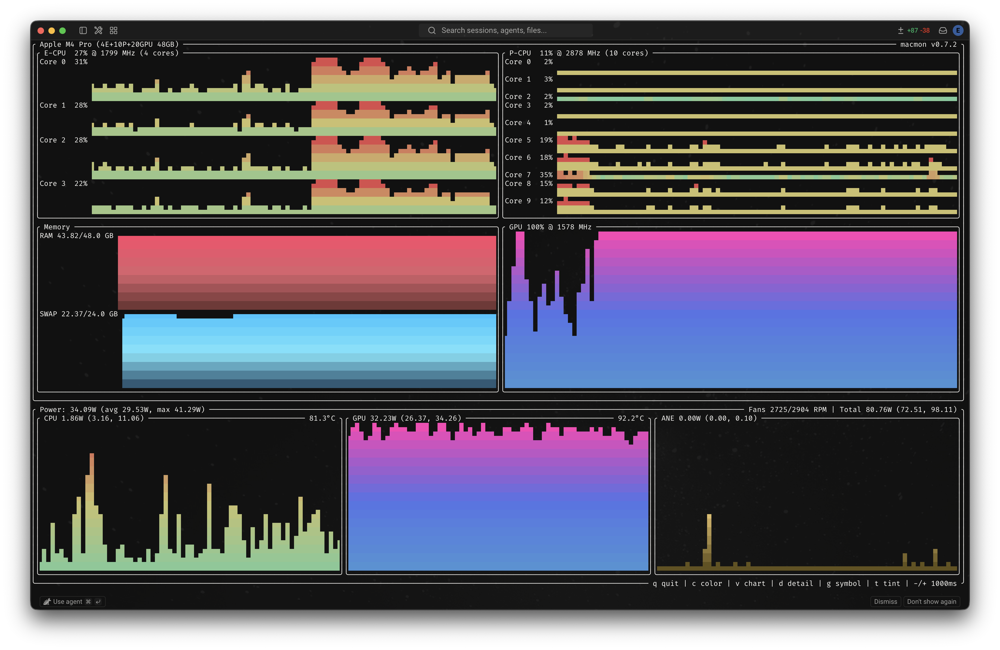

# `macmon` – Mac Monitor

<div align="center">

A macmon fork, colorized.

[](https://github.com/vladkens/macmon/releases)
[](https://github.com/vladkens/macmon/blob/main/LICENSE)
[](https://buymeacoffee.com/vladkens)

</div>

<div align="center">
  
</div>

## Motivation

I just like colors 🎉


## 📥 Build from source

Requires Rust. If you don't have it, install [rustup](https://rustup.rs) (Linux/macOS/WSL):

```bash
curl --proto '=https' --tlsv1.2 -sSf https://sh.rustup.rs | sh
```

Build
```sh
make build
```


## 🚀 Usage

```sh
Usage: macmon [OPTIONS] [COMMAND]

Commands:
  pipe    Output metrics in JSON format
  serve   Serve metrics over HTTP
  debug   Print debug information
  stress  Generate load for testing metrics
  help    Print this message or the help of the given subcommand(s)

Options:
  -i, --interval <INTERVAL>  Update interval in milliseconds [default: 1000]
  -h, --help                 Print help
  -V, --version              Print version

Controls:
  q - quit
  c - change color
  v - switch charts view: gauge / sparkline
  d - toggle detailed CPU/RAM view
  g - change graph symbol (braille / block / TTY)
  t - toggle colored graphs / cycle palettes
  -/+  decrease / increase update interval
```

## 📝 License

`macmon` is distributed under the MIT License. For more details, check out the LICENSE file.

## 🔍 See also

- [vladkens/macmon](https://github.com/vladkens/macmon) – The original tool.
